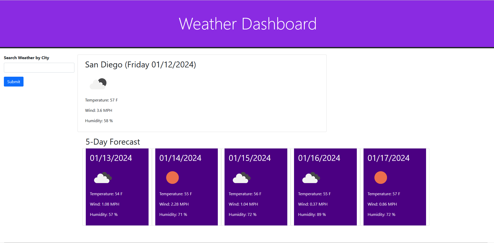

# <weather-dashboard>

## Description

This project aimed to create a weather dashboard using a third party API. The project provided the user a current forecast and 5-day forecast for San Diego when the page loads. The user could also search for different cities and the page would update with data for those cities instead. Searched cities would appear on the page as buttons and when clicked would display weather data for that city.

This project highlighted the use of a third party api to dynamicly display weather information on the page. The project used 3 different OpenWeather API calls to get the lattitude and longitude of a searched city, the current weather data for that city, and the 5-day forecast for that city. Local storage was used to save searched cities when the submit button was pressed and display the city buttons on the page following refreshes. day.JS was used again to parse date information into the desired format.

## Usage

A deployed version of the project can be found at https://mgberrysd.github.io/weather-dashboard/

When loaded the page should appear as:

## Credits

The HTML, CSS, and JS for the weather dashboard was created by Michael Berry.

The project used the OpenWeather API for weather data.